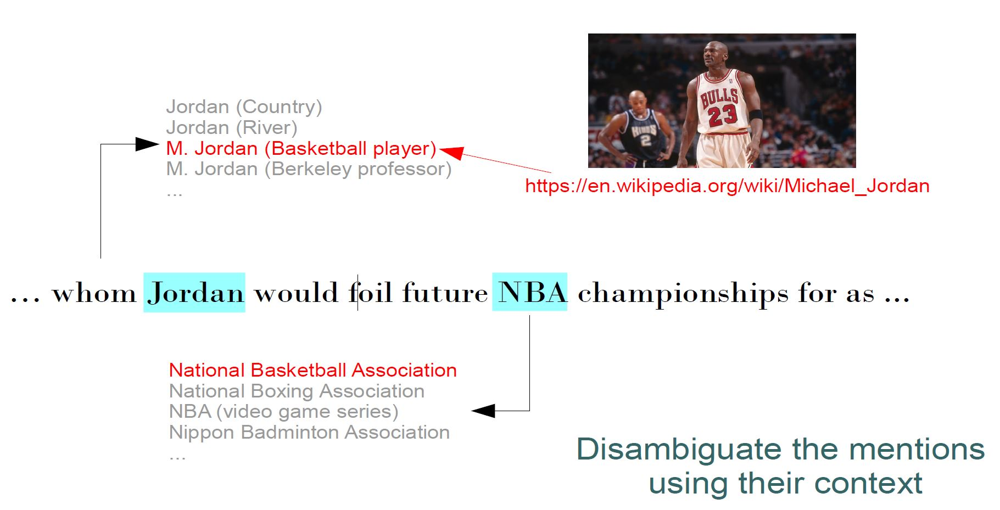

# ZELDA benchmark

ZELDA is a comprehensive benchmark for entity disambiguation (ED). You can use it to train and evaluate ED models.

Download ZELDA as one big zip file [here]([https://nlp.informatik.hu-berlin.de/resources/datasets/zelda/zelda_train.json](https://nlp.informatik.hu-berlin.de/resources/datasets/zelda/zelda_full.zip). Inside, you'll find this structure:

```console
ZELDA
├── train_data
│   ├── zelda_train.conll
│   └── zelda_train.jsonl
├── test_data
│   ├── conll
│   │   ├── test_aida-b.conll
│   │   ├── test_cweb.conll
│   │   ├── test_reddit-comments.conll
│   │   ...
│   └── jsonl
│       ├── test_aida-b.jsonl
│       ├── test_cweb.jsonl
│       ├── test_reddit-comments.jsonl
│       ...
└── other
    ├── zelda_mention_entities_counter.pickle
    └── entity_descriptions.jsonl
```

The `train_data` folder contains the training split (use either conll or jsonl version). The `test_data` folder contains all 9 evaluation splits in both formats. The `other` folder contains entity descriptions and candidate lists.

You should train your model using ZELDA train and evaluate with all splits. The macro-averaged accuracy over all splits is your final evaluation number.


# How to Load

## Load with Flair

The easiest way to load and explore the corpus is through [**`flair`**](https://github.com/flairNLP/flair). Simply use this snippet to load the corpus and iterate through some sentences and their anntation: 


```python
from flair.datasets import ZELDA

# get Zelda corpus and print statistics
corpus = ZELDA()
print(corpus)

# get a sentence of the test split 
sentence = corpus.test[1]

# print this sentence with all annotations 
print(sentence)

# iterate over linked entities in this sentence and print each
for entity in sentence.get_labels('nel'):
    print(entity)
```


## Load in CoNLL-Format

You can load the CoNLL format directly. In this format, each line is a token followed by the ID and URL annotations of this token, in BIO format:

```
-DOCSTART-

# 1163testb SOCCER
SOCCER	O	O
-	O	O
JAPAN	B-993546	B-Japan_national_football_team
GET	O	O
LUCKY	O	O
WIN	O	O
,	O	O
CHINA	B-887850	B-China_national_football_team
IN	O	O
```
## Load in JSONL-Format

In the **jsonl** files each document is in the form of a dictionary with keys 'id', 'text', 'index', 'wikipedia_titles' and 'wikipedia_ids'. For instance, run this snippet to load:

```python
import json

input_jsonl = open('test_data/jsonl/aida-b_final.jsonl', mode='r', encoding='utf-8')

# each line represents one document
first_line = next(input_jsonl)
document_dictionary = json.loads(first_line)

document_text = document_dictionary['text']
mention_indices = document_dictionary['index']
mention_gold_titles = document_dictionary['wikipedia_titles']
mention_gold_ids = document_dictionary['wikipedia_ids']

for index, title, idx in zip(mention_indices, mention_gold_titles, mention_gold_ids):
    mention_start = index[0]
    mention_end=index[1]
    print(f'Mention: {document_text[mention_start:mention_end]} --- Wikipedia title: {title} --- Wikipedia id: {idx}')
```

# How to Cite

Please refer to our paper for information on how the benchmark was constructed:

```
@inproceedings{milich2023zelda,
  title={{ZELDA}: A Comprehensive Benchmark for Supervised Entity Disambiguation},
  author={Milich, Marcel and Akbik, Alan},
  booktitle={{EACL} 2023,  The 17th Conference of the European Chapter of the Association for Computational Linguistics},
  year={2023}
}
```


## What is Entity Disambiguation?

In Entity Disambiguation (ED) we are given text and mentions. The task is then to find the unique meaning (e.g. Wikipedia entity) to what the mentions refer.


We talk about Entity Linking (EL) if the input is raw text and a model has to identify mentions and disambiguate them.  


## How is the benchmark created?

The training corpus is derived from the [Kensho Derived Wikimedia Dataset](https://www.kaggle.com/datasets/kenshoresearch/kensho-derived-wikimedia-data) 
(licence [CC BY-SA 3.0](https://creativecommons.org/licenses/by-sa/3.0/)). We used the "link_annotated_text.jsonl" that provides wikipedia pages
divided into sections. Each section consists of a name, a text and wikipedia hyperlinks specified by offset, length and wikipedia id of the 
referenced page. 

The test corpora are the test split of the [AIDA CoNLL-YAGO](https://www.mpi-inf.mpg.de/departments/databases-and-information-systems/research/ambiverse-nlu/aida/downloads) dataset (AIDA-b), 
the [Reddit EL corpus](https://doi.org/10.5281/zenodo.3970806), the [Tweeki EL corpus](https://ucinlp.github.io/tweeki/), the [ShadowLink dataset](https://huggingface.co/datasets/vera-pro/ShadowLink) and 
the [WNED-WIKI/WNED-CWEB](https://github.com/lephong/mulrel-nel) corpora processed by [Le and Titov, 2018](https://aclanthology.org/P18-1148/).


### How to use the repository
This repository is basically a collection of python scripts to obtain and process the data. First clone the repository and install the requirements. Note that you need at least python>=3.8 to handle the pickled objects.  The intended use is as follows:

1. The test data is ready to use in the test_data folder. Each split comes in jsonl and conll format.

The **conll** files are tab separated. In the first column is a text token, second column contains the wikipedia id and the third column the wikipedia title.
Annotations are equipped with BIO-tags, there is a 'O' for tokens with no annotations. Moreover single documents are separated with a '-DOCSTART-' and in the
beginning of each document there is a comment line (starting with '# ', i.e. hashtag followed by blank) that is a unique identifier for each document.
The form of this identifier depends on the respective dataset and usually does not contain any additional information  except for the two datasets cweb and wikipedia: Here 
the document identifier contains the difficulty bracket (separated by a tab, more information on the brackets see [Guo and Barbosa, 2018](https://www.semantic-web-journal.net/system/files/swj1511.pdf)). In the following example you see the first lines of the aida-b_final.conll file.
```
-DOCSTART-

# 1163testb SOCCER
SOCCER	O	O
-	O	O
JAPAN	B-993546	B-Japan national football team
GET	O	O
LUCKY	O	O
WIN	O	O
,	O	O
CHINA	B-887850	B-China national football team
IN	O	O
```

```
# Output
Mention: JAPAN --- Wikipedia title: Japan national football team --- Wikipedia id: 993546
Mention: CHINA --- Wikipedia title: China national football team --- Wikipedia id: 887850
Mention: AL-AIN --- Wikipedia title: Al Ain --- Wikipedia id: 212131
Mention: United Arab Emirates --- Wikipedia title: United Arab Emirates --- Wikipedia id: 69328
Mention: Japan --- Wikipedia title: Japan national football team --- Wikipedia id: 993546
Mention: Asian Cup --- Wikipedia title: 1996 AFC Asian Cup --- Wikipedia id: 1013464
Mention: Syria --- Wikipedia title: Syria national football team --- Wikipedia id: 1131669
Mention: China --- Wikipedia title: China national football team --- Wikipedia id: 887850
Mention: Uzbekistan --- Wikipedia title: Uzbekistan national football team --- Wikipedia id: 1032413
Mention: China --- Wikipedia title: China national football team --- Wikipedia id: 887850
Mention: Uzbek --- Wikipedia title: Uzbekistan national football team --- Wikipedia id: 1032413
Mention: Igor Shkvyrin --- Wikipedia title: Igor Shkvyrin --- Wikipedia id: 12394021
Mention: Chinese --- Wikipedia title: China --- Wikipedia id: 5405
Mention: Soviet --- Wikipedia title: Soviet Union --- Wikipedia id: 26779
Mention: Asian Cup --- Wikipedia title: AFC Asian Cup --- Wikipedia id: 250683
Mention: Asian Games --- Wikipedia title: 1994 Asian Games --- Wikipedia id: 3285394
Mention: Uzbekistan --- Wikipedia title: Uzbekistan national football team --- Wikipedia id: 1032413
Mention: Japan --- Wikipedia title: Japan national football team --- Wikipedia id: 993546
Mention: Syria --- Wikipedia title: Syria national football team --- Wikipedia id: 1131669
Mention: Takuya Takagi --- Wikipedia title: Takuya Takagi --- Wikipedia id: 7612409
Mention: Hiroshige Yanagimoto --- Wikipedia title: Hiroshige Yanagimoto --- Wikipedia id: 8330373
Mention: Syrian --- Wikipedia title: Syria national football team --- Wikipedia id: 1131669
Mention: Syria --- Wikipedia title: Syria national football team --- Wikipedia id: 1131669
Mention: Hassan Abbas --- Wikipedia title: Hassan Abbas --- Wikipedia id: 21828137
Mention: Syria --- Wikipedia title: Syria national football team --- Wikipedia id: 1131669
Mention: Japan --- Wikipedia title: Japan national football team --- Wikipedia id: 993546
Mention: Syrian --- Wikipedia title: Syria national football team --- Wikipedia id: 1131669
Mention: Syrian --- Wikipedia title: Syria national football team --- Wikipedia id: 1131669
Mention: Japan --- Wikipedia title: Japan national football team --- Wikipedia id: 993546
Mention: Shu Kamo --- Wikipedia title: Shu Kamo --- Wikipedia id: 9087957
Mention: Syrian --- Wikipedia title: Syria national football team --- Wikipedia id: 1131669
Mention: Japan --- Wikipedia title: Japan --- Wikipedia id: 15573
Mention: World Cup --- Wikipedia title: FIFA World Cup --- Wikipedia id: 11370
Mention: FIFA --- Wikipedia title: FIFA --- Wikipedia id: 11049
Mention: UAE --- Wikipedia title: United Arab Emirates national football team --- Wikipedia id: 1044396
Mention: Kuwait --- Wikipedia title: Kuwait national football team --- Wikipedia id: 1041857
Mention: South Korea --- Wikipedia title: South Korea national football team --- Wikipedia id: 1018627
Mention: Indonesia --- Wikipedia title: Indonesia national football team --- Wikipedia id: 1044538
```

Additionally we provide the entity vocabulary of all test splits combined in test_data/wikiids_to_titles_test_splits.pickle.
```
import pickle

with open('test_data/ids_and_titles/wikiids_to_titles_test_splits.pickle', 'rb') as handle:
    ids_to_titles_test_sets = pickle.load(handle)
    
print(f'There are {len(ids_to_titles_test_sets)} entities in the test sets.')

wikipedia_id = list(ids_to_titles_test_sets.keys())[0]

print(f'Wikipedia id: {wikipedia_id} Wikipedia title: {ids_to_titles_test_sets[wikipedia_id]}')

```
```
# Output 
There are 14206 entities in the test sets.
Wikipedia id: 993546 Wikipedia title: Japan national football team
```

2. To create the train split you need to download the [Kensho Derived Wikimedia Dataset](https://www.kaggle.com/datasets/kenshoresearch/kensho-derived-wikimedia-data), 
more specifically the "link_annotated_text.jsonl" file. Moreover, for tokenization we utilize the 'en_core_web_sm' model from [spaCy](https://spacy.io/usage/models). Download it with the following command:
```
python -m spacy download en_core_web_sm
```
Then, to generate the data, you need to set two paths in the script 'repo/scripts/zelda.py' 
```
...
# replace the path with the path to the file 'link_annotated_text.jsonl' on your system
PATH_TO_KENSHO_JSONL = ''

# replace with the path where you saved the repository on your system
PATH_TO_REPOSITORY = ''
...
```
Also you can set two variables 
```
# If you want a conll version of ZELDA-train, set this to true
create_conll_version_of_zelda_train = True
# If you want to generate the entity descriptions, set this to true 
create_entity_descriptions = True
```
Then, all you need to do is to execute 'zelda.py':
```
# go to the scripts folder and call

python zelda.py
```
Note that it may take a few hours to generate all objects. The generated data will be stored in 'repo/train_data' and contains the zelda-train split (in jsonl and conll format), the entity descriptions (in jsonl format), the 
candidate lists (as a pickled dictionary) and a dictionary containing all id-title pairs (of all train and test sets). 
```
# the entity vocabulary can be handled just as the vocabulary of only the test sets

import pickle

with open('train_data/zelda_ids_to_titles.pickle', 'rb') as handle:
    zelda_ids_to_titles = pickle.load(handle)
    
print(f'There are {len(zelda_ids_to_titles)} entities in zelda.')

wikipedia_id = list(zelda_ids_to_titles.keys())[42]

print(f'Wikipedia id: {wikipedia_id} Wikipedia title: {zelda_ids_to_titles[wikipedia_id]}')

# once created, the mention_entities_counter contains, for each collected mention, a dictionary of entity:count pairs where 
# we saved how often we saw the respective mention together with a certain entity. 

with open('train_data/zelda_mention_entities_counter.pickle', 'rb') as handle:
    zelda_mention_entities_counter = pickle.load(handle)
    
mention = 'Ronaldo'
print(zelda_mention_entities_counter[mention])
```
```
# Output
There are 821559 entities in zelda.
Wikipedia id: 9663 Wikipedia title: Electronics
{'Cristiano Ronaldo': 3, 'Ronaldo (Brazilian footballer)': 2}
```

### Candidate Lists

The script scripts/scripts_for_candidate_lists/demo_of_candidate_lists.py demonstrates how we used the candidate lists to achieve the numbers in our paper (add reference).
Note that to use it you need to set the PATH_TO_REPOSITORY variable in the script. Executing it should output the following numbers.

|               | AIDA-B        |TWEEKI         | REDDIT-P      |REDDIT-C       |CWEB           |WIKI           |S-TAIL         |S-SHADOW       |S-TOP          |
| ------------- | ------------- | ------------- | ------------- | ------------- | ------------- | ------------- | ------------- | ------------- | ------------- |
| MFS           |     0,635     |   0,723       |   0,834       |    0,81       |    0,612      |     0,651     |   0,994       |    0,149      |    0,413      |
| CL-Recall     |     0,911     |   0,94        |   0,984       |    0,983      |    0,924      |     0,988     |   0,988       |    0,567      |    0,731      |

MFS ("most frequent sense") chooses, for each mention, the entity that we empirically counted the most often for that mention (assuming the mention is contained in our lists).
CL-Recall (CL for "Candidate List") indicates whether the gold entity is actually contained in the candidate lists for all the mentions. 
The numbers report the accuracy, i.e.  ```#mentions-linking-to-their-mfs/#mentions``` and ```#mentions-that-have-gold-entity-in-their-candidates/#mentions```.

### Other Scripts
All other scripts in this repository (e.g. scripts_for_test_data, scripts_for_candidate_lists) are not needed to create the data and are added for transparency reasons, to show how we created ZELDA. 
The objects (id-title dictionaries, candidate lists, etc.) were created in October 2022. Executing the additional scripts at another time might change the resulting objects 
because Wikipedia continuously evolves. 
